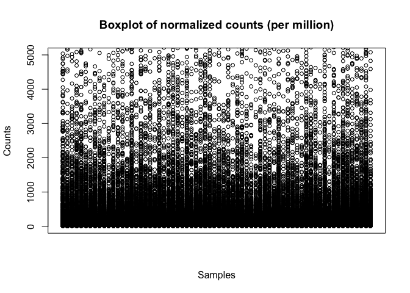
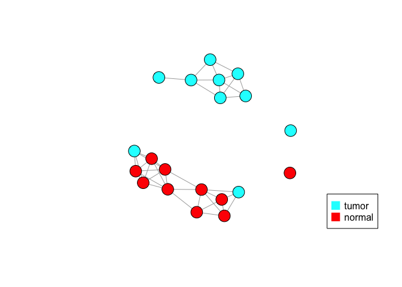
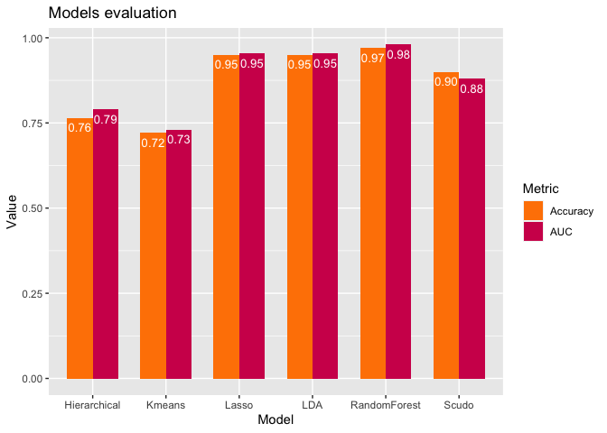
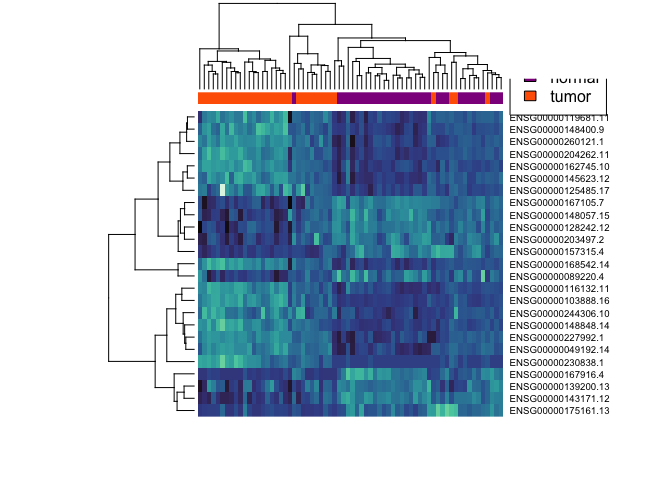
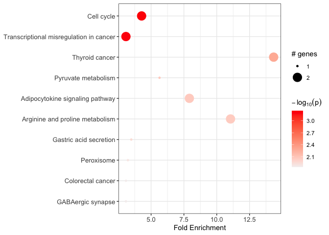

Network-based Data Analysis Project
================

  - [Dataset selection (week 1)](#dataset-selection-week-1)
  - [Pre-processing (week 2)](#pre-processing-week-2)
      - [Filtering](#filtering)
      - [Normalization](#normalization)
  - [Principal Component Analysis (week
    3)](#principal-component-analysis-week-3)
  - [Data Clustering (week 4)](#data-clustering-week-4)
      - [K-means](#k-means)
      - [Hierarchical clustering](#hierarchical-clustering)
  - [Random Forests (week 5)](#random-forests-week-5)
  - [Linear Discriminant Analysis (week
    6)](#linear-discriminant-analysis-week-6)
  - [Lasso regression (week 7)](#lasso-regression-week-7)
  - [Scudo (week 8)](#scudo-week-8)
  - [Models comparison](#models-comparison)
  - [Feature selection](#feature-selection)
  - [Functional enrichment analysis (week
    9)](#functional-enrichment-analysis-week-9)
  - [Biological networks (week 10)](#biological-networks-week-10)

``` r
my_colors <- c("#2e005d", "#5c008b", "#8e008b", "#ff8300", "#ff6200", "#d1105a", "#05a8aa")
library("recount3")
library("ggplot2")
library("edgeR")
library("tidyverse")
library("factoextra")
library("ggtree")
library("randomForest")
library("caret")
library("pROC")
library("genefilter")
library("glmnet")
library("rScudo")
library("viridis")
library("gprofiler2")
library("pathfindR")
library("org.Hs.eg.db")
library("clusterProfiler")
```

# Dataset selection (week 1)

The dataset contains gene expression data of 63856 genes (rows) from 68
patients (columns). Half of the patients are diagnosed with gastric
cancer, while the other half is tumor-free. Some data is available
albout the sex and age of the patients.

The dataset has been retrieved from the *Recount* database: it directly
provides a *count matrix* containing raw counts of gene expression
obtained from sequencing data (Illumina HiSeq 2500 in this case).

``` r
## Fetch the dataset from recount

recount_data <- recount3::create_rse_manual(
    project = "SRP133891",
    project_home = "data_sources/sra",
    organism = "human",
    annotation = "gencode_v26",
    type = "gene",
    verbose = FALSE
)

full_data <- as.data.frame(assay(recount_data))


## Write a csv with the dataset for quick offline access
# write.csv(korData, file = "dataset.csv")
# full_data <- read.csv("dataset.csv", row.names=1)
```

Some data exploratory analysis:

``` r
dim(full_data)
```

    ## [1] 63856    68

``` r
nrow(full_data[which(apply(full_data, 1, sum) > 0),])  # N. rows with sum > 0
```

    ## [1] 53629

``` r
nrow(full_data[which(apply(full_data, 1, sum) > 100),])  # N. rows with sum > 100
```

    ## [1] 52262

``` r
nrow(full_data[which(apply(full_data, 1, sum) > 1000),])  # N. rows with sum > 1000
```

    ## [1] 45299

``` r
col_data <- as.data.frame(colData(recount_data))

# How many samples per condition
table(col_data["sra.experiment_title"])
```

    ## 
    ## Korean specific gastric cancer RNA-Seq (Normal) 
    ##                                              34 
    ## Korean specific gastric cancer RNA-Seq (Turmor) 
    ##                                              34

``` r
# Check for NAs
any(is.na(full_data))
```

    ## [1] FALSE

The metadata table is available


``` r
## Metadata table
info_samples <- read.csv(file = "korTable.csv", header = 1, stringsAsFactors = TRUE, row.names = 1)
# sort korTable rows to be in the same order as full_data columns
info_samples <- info_samples[colnames(full_data),] 
```

# Pre-processing (week 2)

## Filtering

Genes that show very low expression in all the samples are filtered out
of the dataset.

``` r
# Filter low expressed genes:
# Only keep genes with at least a total of 10 counts
filter_data <- full_data[which(apply(full_data, 1, sum) > 10),]
dim(filter_data)
```

    ## [1] 53488    68

## Normalization

The normalization is performed with *geTMM*: which allows for both
inter- and intrasample analyses with the same normalized data set. geTMM
performs correction for sequencing depth and RNA composition and gene
length.

``` r
## Get lengths of genes

info_genes <- as.data.frame(rowData(recount_data))
# colnames(info_genes)
info_genes <- info_genes %>%
  select(gene_name, gene_id, bp_length, gene_type)

info_genes <- info_genes[which(info_genes$gene_id %in% rownames(filter_data)),]

## Calculate RPK (reads assigned per killobase) for each gene

rpk <- filter_data*(10^3)/info_genes$bp_length

## Normalize

rpk <- DGEList(counts = rpk, group = rep("something", ncol(rpk)))
rpk <- calcNormFactors(rpk)
norm_data <- as.data.frame(cpm(rpk))

## Boxplot

boxplot(norm_data, main = "Boxplot of normalized counts (per million)", xlab = "Samples", ylab = "Counts",
        xaxt = "n", col = my_colors[7], ylim=c(0,5000), outcex=0.8)
```

<!-- -->

The boxplot shows that scaling is necesary: in this case the data needs
a log scaling.

``` r
## Log-scaling of data
clean_data <- log2(norm_data+0.1)

## Boxplot

boxplot(clean_data, main = "Boxplot of scaled counts", xlab = "samples", ylab = "normalized counts",
        xaxt = "n", col = my_colors[7], outcex=0.5)
```

<!-- -->

# Principal Component Analysis (week 3)

It is a method for dimensionality reduction. Thousands of dimensions can
be reduced up to 2 or 3 dimensions. The PCA scores show the coordinates
with respect to these new dimensions for the samples of the dataset.

``` r
pca <- prcomp(t(clean_data))

# summary(pca)
# screeplot(pca)

pcaVar <- get_eig(pca)
pcaVar <- pcaVar$variance.percent[1:10]
screeDf <- data.frame("Dimensions" = as.factor(seq(1,10)),
                      "Percentages" = pcaVar,
                      "Labels" = paste(round(pcaVar, 2), "%"))

p <- ggplot(data = screeDf, aes(x=Dimensions, y=Percentages))+
  geom_bar(stat = "identity", fill = my_colors[7])+
  geom_text(aes(label=Labels), vjust=-0.5, color="black", size=3.6)+
  ggtitle("Scree Plot")+
  ylab("Percentge of variance explained")+
  scale_x_discrete(labels = as.factor(seq(1,10)))
p
```

<!-- -->

``` r
## PC 1 and 2

pc12 <- merge(pca$x[,c(1,2)], info_samples, by="row.names")

p <- ggplot(pc12, aes(x=PC1, y=PC2, shape=Sex, color=Group)) +
  geom_point(size = 3)+
  scale_color_manual(values=my_colors[c(3,5)])+
  ggtitle("PCA for components 1 and 2")
  
p

## Pc 2 and 3

pc23 <- merge(pca$x[,c(2,3)], info_samples, by="row.names")

p <- ggplot(pc23, aes(x=PC2, y=PC3, shape=Sex, color=Group)) +
  geom_point(size = 3)+
  scale_color_manual(values=my_colors[c(3,5)])+
  ggtitle("PCA for components 2 and 3")
  
p

## PC 1 and 3

pc13 <- merge(pca$x[,c(1,3)], info_samples, by="row.names")

p <- ggplot(pc13, aes(x=PC1, y=PC3, shape=Sex, color=Group)) +
  geom_point(size = 3)+
  scale_color_manual(values=my_colors[c(3,5)])+
  ggtitle("PCA for components 1 and 3")
  
p


## female

pc12f <- pc12[which(pc12$Sex == "female"),]

p <- ggplot(pc12f, aes(x=PC1, y=PC2, color=Group, size=Age)) +
  geom_point()+
  scale_color_manual(values=my_colors[c(3,5)])+
  ggtitle("PCA for components 1 and 2 - WOMEN")
  
p

## male

pc12m <- pc12[which(pc12$Sex == "male"),]

p <- ggplot(pc12m, aes(x=PC1, y=PC2, color=Group, size=Age)) +
  geom_point(shape=17)+
  scale_color_manual(values=my_colors[c(3,5)])+
  ggtitle("PCA for components 1 and 2 - MEN")
  
p
```


# Data Clustering (week 4)

## K-means

Unsupervised method, simple and quick to understand and implement. It
relies on the tuning parameter K (number of resulting clusters) and is
sensitive to outliers, not an advanced methods, to be used for a first
exploratory analysis.

K-means is computed setting K=2, since we know there are two groups of
patients (normal and tumor). The results are plotted with a pca for a
better visualization.

``` r
set.seed(1)

## Compute K-means clusters

K=2
km2 <- kmeans(t(clean_data), K)
# table(km$cluster)

km2plot <- data.frame("Row.names" = names(km2$cluster),
                      "Cluster" = as.factor(km2$cluster))
km2plot <- merge(km2plot, pc12, by="Row.names")

p <- ggplot(km2plot, aes(x=PC1, y=PC2, color=Cluster, shape=Group)) +
  geom_point(size = 3)+
  scale_shape_manual(values = c(0,15))+
  scale_color_manual(values = my_colors[c(6,7)])+
  ggtitle("K-means results - 2 clusters")
  
p
```

<!-- -->

``` r
rm(km2plot)
```

``` r
## Create list with the predictions
pred_k <- km2$cluster
pred_k[which(pred_k==1)] <- "tumor"
pred_k[which(pred_k==2)] <- "normal"
pred_k <- factor(pred_k,levels = c("normal", "tumor"))

## Accuracy
acc_k <- mean(pred_k==info_samples$Group)

## AUC from ROC curve
roc_k <- roc(as.numeric(pred_k), as.numeric(info_samples$Group))
# plot(roc_rf)
auc_k <- auc(roc_k)
```

``` r
## Crete dataframe to store the accuracy results
res_df <- data.frame(Kmeans = c(acc_k, auc_k))
rownames(res_df) <- c("accuracy", "AUC")
```

## Hierarchical clustering

It produces a dendrogram: at each step a distance matrix is computed and
the points with the lower distance are clustered together, then the
distance matrix is recomputed considering the new cluster as one point.
In the end, the tree is cut to have the chosen number of clusters.

For this clustering method, distance between samples and between
clusters must be computed. In this case, sample distances are computed
with the *Euclidean* method, and the cluster distances with *average
linkage*.

``` r
## Distance matrix
dist_matrix <- dist(t(clean_data), method = "euclidean")
## Clustering
hc <- hclust(dist_matrix, method ="average")
hc$height <- hc$height-80

## Cut the tree, in this case the best division is obtained by cutting the tree after 4 divisions.
## K=6 because the tree is divided in 6 clusters, the first 5 are grouped together as cluster 0.
hclusters <- cutree(hc, k = 6)

## Plot the tree
hclusters <- hclusters[order(names(hclusters))]
tipData <- data.frame(samples=rownames(info_samples),
                      group=info_samples$Group,
                      sex=info_samples$Sex)

hcc <- groupOTU(.data = ggtree(hc), group_name = "cluster", .node = names(hclusters)[which(hclusters==1) ])+
  aes(linetype=cluster)

hcc %<+% tipData +
  layout_dendrogram() +
  geom_tippoint(aes(color=group, shape=sex), size=2.3) +
  scale_color_manual(values = my_colors[c(3,5)]) +
  ggtitle("Hierarchical clustering")
```

<!-- -->

``` r
## Create list with the predictions
pred_h <- hclusters
pred_h[which(hclusters==1)] <- "normal"
pred_h[which(hclusters!=1)] <- "tumor"
pred_h <- factor(pred_h,levels = c("normal", "tumor"))

## Accuracy
acc_h <- mean(pred_h==info_samples$Group)

## AUC from ROC curve
roc_h <- roc(as.numeric(pred_h), as.numeric(info_samples$Group))
# plot(roc_rf)
auc_h <- auc(roc_h)


## Update results table
res_df["Hierarchical"] <- c(acc_h, auc_h)
```

# Random Forests (week 5)

From now on, the classification methods are supervised methods. For this
purpose, the data is divided in a training and a test set.

``` r
# The CARET package is used to divide the dataset in training and test set
set.seed(1)

train_ind <- createDataPartition(info_samples$Group, p = 0.7)$Resample1

train_data <- clean_data[train_ind]
# dim(train_data)
test_data <- clean_data[-train_ind]
# dim(test_data)
yTrain <- info_samples[train_ind,"Group"]
yTest <- info_samples[-train_ind,"Group"]
```

Random forest requires the tuning of 2 parameters: *ntree* and the
*mtry*. The first is the number of trees to grow and the second is the
number of features (genes) considered when building each tree. The best
parameters are chosen comparing OOB errors of random forests fitted with
different values of the two parameters.

``` r
set.seed(1)

## Fit a first random forest to determine the best number of trees 
rf <- randomForest(t(train_data), y = yTrain)
plot(rf)
```

<!-- -->

``` r
ntree <- 200
```

The first plot shows that a plateau in the OOB error is reached with a
number of trees around 200.

``` r
control <- trainControl(method='cv', 
                        search='grid')
#create tunegrid with 15 values from 1:15 for mtry to tunning model. Our train function will change number of entry variable at each split according to tunegrid. 
mtry <- sqrt(nrow(train_data))
tunegrid <- expand.grid(mtry = seq(mtry-50, mtry+50, by = 10)) 

rf_gridsearch <- train(x=t(train_data), y=yTrain,
                       method = 'rf',
                       ntree=200,
                       metric = 'Accuracy',
                       tuneGrid = tunegrid,
                       trControl = control)
# print(rf_gridsearch)

mtry <- rf_gridsearch$bestTune$mtry
```

The best mtry results to be 251.2747. Next, a model is built on the
training set with these parameters and evaluated on the test set.

``` r
set.seed(1)

tunegrid <- expand.grid(.mtry=c(mtry))
rf <- train(x=t(train_data), y=yTrain,
             method = 'rf',
             ntree=200,
             metric = 'Accuracy',
             tuneGrid = tunegrid,
             trControl = control)
# print(rf)
```

``` r
set.seed(1)

## Apply it on the test set
pred_rf <- predict(rf, t(clean_data))

## Accuracy
acc_rf <- mean(pred_rf==info_samples$Group)
## Confusion matrix
# table(pred_rf, yTest)

## AUC from ROC curve
prob_rf <- predict(rf, t(test_data), type = "prob")
roc_rf <- roc(yTest, prob_rf$normal)
# plot(roc_rf)
auc_rf <- auc(roc_rf)

## Update df
res_df["RandomForest"] <- c(acc_rf, auc_rf)
```

# Linear Discriminant Analysis (week 6)

The idea of LDA is to reduce dimensionality while preserving the ability
to discriminate. The samples are projected on a line. Choose the line
that maximizes the separation of the points.

In order to perform an lda, a feature selection is necessary to reduce
the number of genes considered. In this case, it is dove with a ttest.

``` r
## T test
tt <- rowttests(as.matrix(clean_data), info_samples$Group)
tt <- which(p.adjust(tt$p.value)<0.1)

## Reduce the original dataset
tt_data <- clean_data[tt,]
# dim(tt_data)
tt_train <- tt_data[train_ind]
# dim(tt_train)
```

Fit an lda model with a 10-fold cross-validation and evaluate the model.

``` r
set.seed(1)

## Fit the model with cv
control <- trainControl(method="cv", number=10)
lda_fit <- train(t(tt_train), yTrain, method="lda", 
                 metric="Accuracy", trControl=control)
# print(lda_fit)

## Apply it on the test set
pred_lda <- predict(lda_fit, t(test_data))

## Accuracy
acc_lda <- mean(pred_lda==yTest)

## AUC from ROC curve
roc_lda <- roc(as.numeric(pred_lda), as.numeric(yTest))
# plot(roc_rf)
auc_lda <- auc(roc_lda)


## Update results table
res_df["LDA"] <- c(acc_lda, auc_lda)
```

# Lasso regression (week 7)

``` r
set.seed(1)

## fit Lasso with cv
control <- trainControl(method="cv", number=10)
tunegrid <- expand.grid(alpha=1,
                        lambda=seq(0,1,by=0.05))
lasso_fit <- train(t(train_data), yTrain, method="glmnet", family="binomial", 
                 tuneGrid = tunegrid,
                 metric="Accuracy", trControl=control)
# print(lasso_fit)

## Apply it on the test set
pred_lasso <- predict(lasso_fit, t(test_data))

## Accuracy
acc_lasso <- mean(pred_lasso==yTest)

## AUC from ROC curve
roc_lasso <- roc(as.numeric(pred_lasso), as.numeric(yTest))
# plot(roc_rf)
auc_lasso <- auc(roc_lasso)


## Update results table
res_df["Lasso"] <- c(acc_lasso, auc_lasso)
```

# Scudo (week 8)

The goal of this method is to avoid batch effects and obtain a method
that is repeatable and reproducible.

This method compares signatures of different individuals. Each signature
is sorted for the expression value. The most important genes for each
signature are the most and the less expressed. Then signatures are
compared and a map is constructed, where clusters can be seen if they
are colsely connected.

``` r
set.seed(1)
## Apply SCUDO on the training set

scudo_train <- scudoTrain(train_data, groups = yTrain,
                          nTop = 25, nBottom = 25, alpha = 0.05)
scudo_train
```

    ## Object of class ScudoResults
    ## Result of scudoTrain 
    ## 
    ## Number of samples      :  48 
    ## Number of groups       :  2 
    ##     normal :  24 samples
    ##     tumor :  24 samples
    ## upSignatures length    :  25 
    ## downSignatures length  :  25 
    ## Fold-changes           :  computed 
    ##     grouped            :  No  
    ## Feature selection      :  performed
    ##     Test               :  Wilcoxon rank sum test
    ##     p-value cutoff     :  0.05 
    ##     p.adjust method    :  none 
    ##     Selected features  :  17465

``` r
# inspect signatures 
# upSignatures(trainRes)
# consensusUpSignatures(trainRes)

## perform validation using testing samples
scudo_test <- scudoTest(scudo_train, test_data, yTest,
                        nTop = 25, nBottom = 25)

## Plot the results
testNet <- scudoNetwork(scudo_test, N = 0.2)
scudoPlot(testNet, vertex.label = NA)
```

<!-- -->

``` r
## Classification
pred_scudo <- scudoClassify(train_data, test_data,
                            nTop = 25, nBottom = 25, N = 0.2,
                            trainGroups = yTrain,
                            featureSel = FALSE)
## Accuracy
acc_scudo <- mean(pred_scudo$predicted==yTest)

## AUC from ROC curve
roc_scudo <- roc(yTest, pred_scudo$scores[,2])
# plot(roc_rf)
auc_scudo <- auc(roc_scudo)


## Update results table
res_df["Scudo"] <- c(acc_scudo, auc_scudo)
```

# Models comparison

The models fitted before are compared by accuracy and AUC. The random
forest appears to be the best performing model according to both the
metrics.

``` r
res_plot <- data.frame(Model = rep(colnames(res_df),2),
                       Metric = rep(c("Accuracy", "AUC"), each=ncol(res_df)),
                       Value=c(as.numeric(res_df[1,]), as.numeric(res_df[2,])))
res_plot["Labels"] <- sprintf("%.2f", res_plot$Value)
# res_plot

ggplot(res_plot, aes(x=Model, y=Value, fill=Metric))+
  geom_bar(stat="identity", position="dodge", width=0.7)+
  scale_fill_manual(values = c(my_colors[c(4,6)]))+
  ggtitle("Models evaluation")+
  geom_text(aes(label=Labels), vjust=1.6, color="white",
            position = position_dodge(0.7), size=3.5)
```

<!-- -->

# Feature selection

Since random forest was selected as the best performing model, a feature
selection was performed considering the importance score assigned to
each gene when fitting the random forest. The following genes are the
most relevant ones for the classification of the samples according to
the random forest algorithm.

``` r
# Importance
imp <- varImp(rf)
imp <- imp$importance
imp["gene"] <- rownames(imp)
colnames(imp) <- c("importance", "gene")
imp <- imp[order(imp$importance, decreasing = TRUE),]
rownames(imp) <- seq(1:nrow(imp))
geneList <- unlist(strsplit(imp$gene, ".", fixed = TRUE))
imp$gene_clean <- geneList[which(startsWith(geneList, "ENS"))]

head(imp)
```

    ##   importance               gene      gene_clean
    ## 1  100.00000  ENSG00000167916.4 ENSG00000167916
    ## 2   93.25853 ENSG00000168542.14 ENSG00000168542
    ## 3   73.41091 ENSG00000125485.17 ENSG00000125485
    ## 4   64.32587 ENSG00000244306.10 ENSG00000244306
    ## 5   61.65081 ENSG00000143171.12 ENSG00000143171
    ## 6   60.75153 ENSG00000148848.14 ENSG00000148848

``` r
imp25 <- imp$gene[1:25]
imp25_data <- clean_data[is.element(rownames(clean_data), imp25),]

hmcol <- viridis(1000, option="mako")
csc <- rep(my_colors[3],ncol(imp25_data))
csc[info_samples$Group=='tumor'] <- my_colors[5]
imp25_data <- as.matrix(imp25_data)
heatmap(imp25_data, scale="row", col=hmcol, ColSideColors=csc,
        # main = "25 most important genes", 
        labCol = FALSE)
legend(x=0.78, y=1.07, legend=c("normal", "tumor"), fill=my_colors[c(3,5)])
```

<!-- -->

# Functional enrichment analysis (week 9)

The functional enrichment analysis is performed with *gprofiler2*, with
the objective of finding out the molecular functions more represented
among the most important genes. For this purpose, the 200 genes with
highest importance score according to the random forest model fitted
before are considered.

``` r
geneList <- imp$gene_clean[1:200]

gost_res <- gost(query = geneList,
                organism = "hsapiens", 
                ordered_query = FALSE, multi_query = FALSE, significant = FALSE, 
                exclude_iea = FALSE, measure_underrepresentation = FALSE, evcodes = FALSE,
                user_threshold = 0.05, correction_method = "g_SCS",
                domain_scope = "annotated", custom_bg = NULL, numeric_ns = "", 
                sources = NULL, as_short_link = FALSE)

gost_df <- gost_res$result[c("term_id", "term_name", "p_value", "significant")]
gost_df <- gost_df[order(gost_df$p_value),]
gost_df <- gost_df[which(gost_df$significant==TRUE),]

# head(gost_df)

# visualize results using a Manhattan plot
p <- gostplot(gost_res, capped = TRUE, interactive = FALSE)
publish_gostplot(p, filename = NULL)
```

<!-- -->

``` r
publish_gosttable(gost_res, highlight_terms = gost_df$term_id[1:10],
                  use_colors = TRUE, filename = NULL,
                  show_columns = c("term_id", "term_name", "p_value"))
```

<!-- -->

# Biological networks (week 10)

The network analysis is performed with *pathfindR*, using the *KEGG*,
*Gene Ontology* and *Reactome* databases. For this analysis, the 100
genes with the lowest p value obtained with a t test are taken into
consideration. This list of genes has 23 genes in common with the one of
the most important genes used for the functional enrichment.

``` r
## T test
tt <- rowttests(as.matrix(clean_data), info_samples$Group)
tt <- tt[order(tt$p.value),]

geneList_tt <- data.frame(ENSEMBL = rownames(tt)[1:100],
                          p.value = tt$p.value[1:100])
                          # p.adjust = p.adjust(tt$p.value[1:100]))

a <- unlist(strsplit(geneList_tt$ENSEMBL, ".", fixed = TRUE))
geneList_tt$ENSEMBL <- a[which(startsWith(a, "ENS"))]
a <- bitr(geneList_tt$ENSEMBL, 
          fromType = "ENSEMBL",
          toType = "SYMBOL",
          OrgDb = org.Hs.eg.db)

geneList_tt <- merge(a,geneList_tt)
rm(a)

# dim(geneList_tt)
```

``` r
net_KEGG <- run_pathfindR(geneList_tt[c("SYMBOL", "p.value")],
                          iterations = 1, # keeps running time low - default is 10
                          gene_sets = "KEGG", 
                          visualize_enriched_terms = FALSE,
                          silent_option = FALSE)

# ## cluster enriched terms
# patR_clu <- cluster_enriched_terms(patR_res)
# ## term-gene graph of top 10 terms
# term_gene_graph(patR_res)

net_GO <- run_pathfindR(geneList_tt[c("SYMBOL", "p.value")],
                          iterations = 1, # keeps running time low - default is 10
                          gene_sets = "GO-All", 
                          visualize_enriched_terms = FALSE,
                          silent_option = FALSE)
```

<!-- -->

``` r
net_Reactome <- run_pathfindR(geneList_tt[c("SYMBOL", "p.value")],
                          iterations = 1, # keeps running time low - default is 10
                          gene_sets = "Reactome", 
                          visualize_enriched_terms = FALSE,
                          silent_option = FALSE)
```

<!-- --><!-- -->

``` r
enrichment_chart(net_KEGG)
```

<!-- -->

``` r
enrichment_chart(net_GO)
```

<!-- -->

``` r
enrichment_chart(net_Reactome)
```

<!-- -->

``` r
term_gene_graph(net_Reactome, num_terms = 7, use_description = TRUE)
```

<!-- -->
