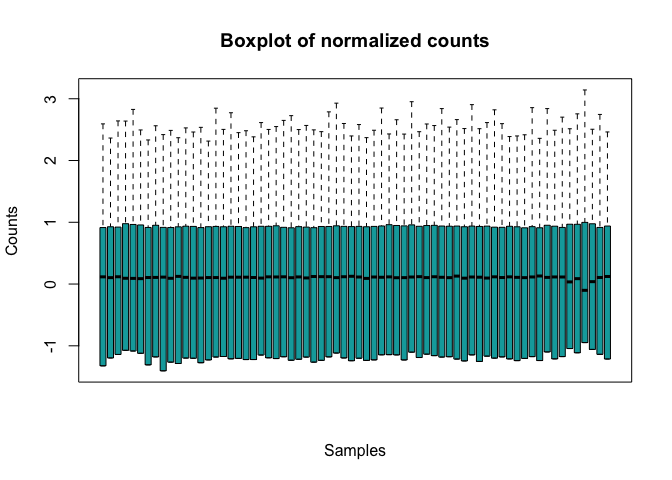
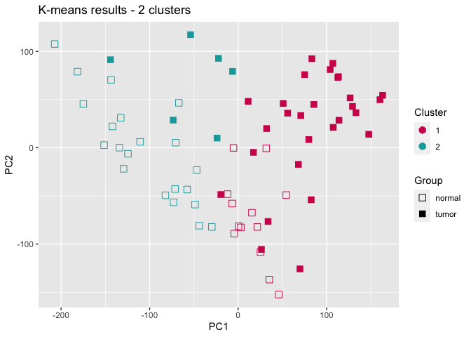
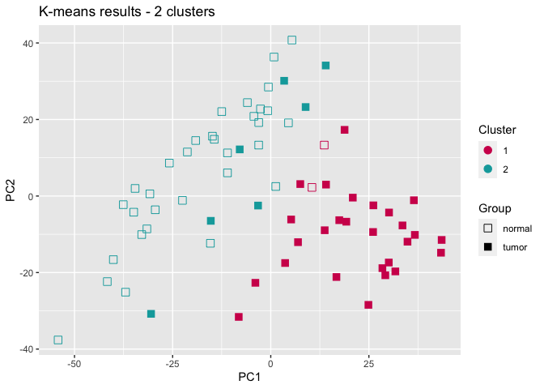
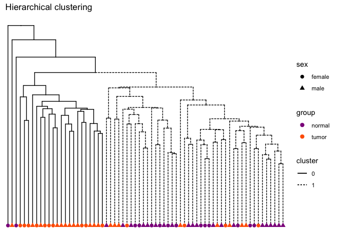

Network-based Data Analysis
================

  - [Week 1](#week-1)
      - [Introduction to Omics](#introduction-to-omics)
  - [Week 2](#week-2)
      - [High-throughput data: gene expression
        profiles](#high-throughput-data-gene-expression-profiles)
      - [Dataset selection](#dataset-selection)
  - [Week 3](#week-3)
      - [The data analysis process](#the-data-analysis-process)
      - [Pre-processing:](#pre-processing)
  - [Week 4](#week-4)
      - [Classification methods](#classification-methods)
  - [Week 5](#week-5)
      - [Data clustering: Random
        Forests](#data-clustering-random-forests)
  - [Week 6](#week-6)
      - [Linear Methods?](#linear-methods)
  - [Week 7](#week-7)
      - [Lasso and Ridge](#lasso-and-ridge)
  - [Week 8](#week-8)
      - [Scudo](#scudo)

``` r
# library("GEOquery")
# library("hgu133a.db")
library("recount3")
library("ggplot2")
library("factoextra")
library("useful")
library("pheatmap")
library("viridis")
library("ALL")
library("genefilter")
library("randomForest")
library("glmnet")
library("ggtree")
library("rScudo")
library("caret")
library("igraph")

set.seed(1)
```

-----

# Week 1

01/03

## Introduction to Omics

Omics data types:

  - Genomics
  - Transcriptomics
  - Proteomics
  - Metabolomics

During this course we will focus on transcriptomics, because it is the
easiest one.

### Genotype data

Collection of SNPs, which are the most common type of difference between
the genome of two human individuals. Data example: a table where each
row is an individual and each column is a SNP. Values in the table
indicate which variation of the SNP the individual presents.

Approach: dimensionality reduction (For example PCA reduces the dataset
to 2 or 3 dimensions) Applications: history studies, genealogy studies,
forensics, … Another application is genome-wide association studies (
**GWAS** ). The aim is to find genomic markers of disease through
scanning of genetic markers in large enough populations. Not so easy
because most of the diseases are caused by variations in multiple
different genes.

### Transcriptomic data

The measure of abundance of RNA transcripts.

Techniques: **RNA microarrays** to measure levelsd of mRNA. Now they are
being replaced by **RNAseq**. RNAseq needs a little more data
processing.

-----

03/03

### Proteomics

**Proteome**: set of all proteins produced under a given set of
conditions.

Main technologies:

  - 2D **gel electrophoresis** –\> separate molecules by size. Can be
    done with Isoelectric Focusing: separates based on isoelectric pH.
    The 2D version combines the two separations (molecularweight +
    electirc charge)
  - Liquid chromatography mass spectrometry ( **LC-MS/MS** )
  - Chip: **Protein Array** –\> the chip has aptamers: molecules
    designed to specifically bind a protein.

Proteomics is still relatively limited: problems can remain with
purification and stability of proteins

### Metabolomics

Metabolite are small molecules in the cell that are the intermediates
and products of metabolism. The metabolome is The complete collection of
small molecule metabolites in a cell, organ, tissue or organism. It
includes endogenous and exogenous molecules as well as transient or even
theoretical molecules, it is defined by the detection technology. –\>
very time-sensitive

Metabolomics uses high-throughput technologies to characterize the
metabolome. There are 2 approaches: *quantitative* (targeted) and
*chemometric* (profiling).

### Other high-throughput biological data

**Epigenetic modifications** –\> the study of heritable changes in gene
activity that are not caused by changes in the DNA sequence (DNA
methylation, histone modifications).

*Histone modification analysis*: histone purification and isolation,
**ChIP** (Chromatin ImmunoPrecipitation) or other histone analysis.

**miRNA** analysis –\> isolation of miRNAs from the total RNA, analysis
via *microarrays* or *deep sequencing*.

**Protein-protein interaction (PPI)** (proteome –\> interactome).

### Analytical Goals in Omics Analysis

  - Exploratory/discovery analysis
      - which samples exhibit similar patterns across all variables?
      - which variables exhibit similar patterns across all samples?
  - Classification/group comparison
      - which variables are significantly different between pre-defined
        groups?
      - Regression analysis
  - Which variables are significantly correlated with a given continuous
    predictor variable?
      - Functional annotation of results
  - Which biological functions are altered in our phenotype/challenge of
    interest?

### Clinical study design

  - Cell/tissue culture
      - primary culture
      - immortalized cell-line
  - Model organism
      - genetic knockout models
  - Human

-----

# Week 2

08/03

## High-throughput data: gene expression profiles

### Measuring RNA and Proteins

Proteins:

  - Western Blot
  - ELISA
  - Northern blot
  - Enzyme assay

RNA:

  - Microarrays
  - RNA-Seq
  - RT-PCR

Microarrays are stil used but RNA-Seq is the most innovative technique.

The amount RNA is not usually linearly correlated with the amount of
Protein.

Gene expression \!= amount of protein

### Microarrays

Developed in the early 1990s. After production on a large scale, they
became quite affordable. Flexible technology –\> can be repurpose to
quantify expression levels of miRNAs, SNPs, Proteins and for comparative
genome hybridization.

**Basic idea**: RNA –\> Reverse transcript to cDNA –\> Biotin labelling
–\> Fragmentation –\> Hybridization with the Microarray chip –\>
Washing and staining –\> Scan and Quantitate

Main Microarrays companies: Affymetrics, Illumina

**Possible sources of errors**: sample contamination by molds, poor
quality/insuficient mRNA, biases in fluorescent labelling and in the
reverse transcription, poor hybridization/cross hybridization,
defective/damaged chips. To reduce the chances of cross hybridization,
the chips are designed keeping distant the sequences with high risk.
Background noise should be excluded. *Normalization* is often needed to
allineate all values.

Other problems of Microarrays:

  - Gene not on the chip
  - Cannot usually differentiate splicing variants
  - Quantity could be under detection limit
  - Cannot differentiate RNA synthesis and degradation
  - Can’t tell us about post translational events
  - Bioinformatics can be difficult

**Raw data formats**: *MIAME*, *MAGE-ML*, but different companies have
different standards. We are going to use *Bioconductor*: open source
software for Bioinformatics. Most Microarrays have their specific
bioconductor package to analyze their data.

**Resources**: Microarray data repositories –\> *Array express*, *GEO*
(Gene Expression Omnibus), *Recount2*

### RNA-Seq

Whole transcriptome shotgun sequencing.

Workflow:

  - RNA Sequencing
  - Quality Control
  - Mapping
  - Quantification
  - Pre-processing
  - Differential Expression Analysis
  - Functional Analysis
  - Network-Based Enrichment Analysis

A lot of computational power is needed: this process is only possible
thanks to powerful computers or online access to server.

**Recount** –\> They performed all the steps on dataasets from GEO,
starting from the sequencing output. Recount directly provides raw
counts: a *count matrix* (row=genes, columns=samples)

**GEO** –\> some datasets provide counts, others only the raw sequencing
data.

Our project starts from count matrices.

### Pre-processing of transcriptomics data

Filtering of low expressed genes.

Normalization of the count matrix: needed to compare different genes in
the same sample or the same gene in different samples. The nuber of
reads should be normalized with respect to the length of the gene,
otherwse longer genes will for sure have a nigher number of reads
associated.

**Whithin-sample normalization methods**:

Used for comparisons between samples of the same group.

  - RPM/CPM: reads/counts per million mapped reads –\> correction for
    sequencing depth
  - RPKM/FPKM: correction for sequencing depth and gene length
  - TPM: transcripts per million –\> correction for sequencing depth and
    gene length

**Between-sample normalization methods**:

The goal is to identify when the difference between the average counts
of two groups is significantly different ( *Differential Expression
Analysis* ). Used when we want to compare gene expression between
different samples. The method is a Ttest, uses the standard deviation.

  - DeSeq2: correction for sequencing depth and RNA composition
  - TMM: correction for sequencing depth and RNA composition
  - GeTMM: correction for sequencing depth and RNA composition and gene
    length

For our project we are going to use one of these.

-----

10/03

## Dataset selection

Usually control vs test:

  - Placebo vs Drug treatment
  - Wild-type vs Knockout
  - Healthy vs Patient
  - Normal tissue vs Cancerous tissue
  - Time = 0 vs Time = 1 Time = 2…

Biological replicates –\> necessary: independent biological samples
Technical replicates –\> not necessary for us: same samples on different
microarrays

Based on the biological questions, there are various types of knowledge
that can be extracted by a set of differentially expressed genes.

Data comes with proprietary probe IDs (i.e. Affymetrix ID), but there
are functions to perform the annotation in terms of standard ID’s
(i.e. Entrez)

-----

``` r
## Recount 3 korean dataset

kor <- recount3::create_rse_manual(
    project = "SRP133891",
    project_home = "data_sources/sra",
    organism = "human",
    annotation = "gencode_v26",
    type = "gene"
)

korData <- as.data.frame(assay(kor))
```

``` r
dim(korData)
```

    ## [1] 63856    68

``` r
nrow(korData[which(apply(korData, 1, sum) > 0),])  # N. rows with sum > 0
```

    ## [1] 53629

``` r
nrow(korData[which(apply(korData, 1, sum) > 100),])  # N. rows with sum > 100
```

    ## [1] 52262

``` r
nrow(korData[which(apply(korData, 1, sum) > 1000),])  # N. rows with sum > 1000
```

    ## [1] 45299

``` r
korColData <- as.data.frame(colData(kor))
# colnames(korColData)
table(korColData["sra.experiment_title"])
```

    ## 
    ## Korean specific gastric cancer RNA-Seq (Normal) 
    ##                                              34 
    ## Korean specific gastric cancer RNA-Seq (Turmor) 
    ##                                              34

``` r
korTable <- read.csv(file = "korTable.csv", header = 1, stringsAsFactors = TRUE, row.names = 1)
korTable["a70years"] <- "over"
korTable$a70years[which(korTable$age < 70)] <- "under"
korTable$a70years <- as.factor(korTable$a70years)
korTable <- korTable[order(rownames(korTable)),]

korClean <- korData[which(apply(korData, 1, sum) > 0),]
dim(korClean)
```

    ## [1] 53629    68

-----

# Week 3

15/03

## The data analysis process

data: `p x n` matrix. Usually `p >> n`. Choose a number of samples
greater than 10 (better 20) but lower than 100 (otherwise computational
problems could arise, if the dataset is bigger choose only some
conditions).

  - p –\> number of genes
  - n –\> number of samples

Not all genes in the dataset are informative. Some microarrays have
mouse genes or other sorts of foreign DNA in order to calibrate or check
the quality of the microarray. For this reasons data preprocessing is
needed.

Possible questions:

**Class discovery** –\> Identify groups of genes having a similar
expression profile

**Class Prediction** –\> Find a rule useful for classifying samples. For
example for diagnosis based on expression profiles

Differentially expressed genes can be identified with a **T-test**.
Doing a T-test for each gene could cause some problems: multiplicity
problems. For this reason, the P-value should be adjusted (Bonferroni or
Benjamini-Hochberg correction). The T-test is not ideal for class
discovery and prediction but can be used to draw some nice heatmaps or
to classify/rank the genes (find the most interesting).

The first thing to do with the dataset is a manual inspection: check if
there are too many 0s or NAs and familiarize with the data.
Identification of potential probems.

## Pre-processing:

### Data normalization

First, visualize with a **boxplot**.

Possible surces of variations:

  - Systematic –\> can be solved with normalization
  - Random –\> technical and biological replicates to reduce them

Strategy: a set of genes is used as reference and it is considered not
to change across samples and conditions. This could be done adding some
known quantities of RNA or by considering housekeeping genes. Many other
advanced techniques are possible.

Our strategy: normalization to a median of zero by computing the means
and subtracting them to the values. Now the boxplots are aligned. Scale
normalization is now needed to scale the boxes of the plot, to do this
divide the data by the absolute deviation or the mad. In R, this can be
done with `scale(x)`. This function automatically doea Median centering
and Scale normalization.

If a T-test is needed, it has to be performed on normalized data.

**MAD** = Median Absolute Deviation. It is a more robust function for
the absolute deviation, useful because of outliers that could bring
problems to the standard deviation. Removing the outliers is always
controversial because it could generate a bias in the data. Also, there
is no clear definition of outlier. To avoid this probem we do not remove
the outliers in this stage of analysis. Instead, we ose the *median* and
the *mad* as robust alternatives for the mean and the standard
deviation.

### Data transformation

To be performed for a valid reason only\! Always check the data first
becaus it could be already transformed.

**Log Transformation** –\> To know if it is necessary, look at the
boxplot and at the value reached by the data. **Ranks** **Z-score** –\>
same as scale normalization ??

### Principal Component Analysis

It is a method for dimensionality reduction. Thousands of dimensions can
be reduced up to 2 or 3 dimensions. The PCA scores show the coordinates
with respect to these new dimensions for the samples of the dataset.

-----

17/03

``` r
my_colors <- c("#2e005d", "#5c008b", "#8e008b", "#ff8300", "#ff6200", "#d1105a", "#05a8aa")

korClean <- korData[which(apply(korData, 1, sum) > 0),]
# dim(korClean)
korClean2 <- log1p(korClean)
# boxplot(korClean2)
korClean3 <- as.data.frame(scale(korClean2))
boxplot(korClean3, main = "Boxplot of normalized counts", xlab = "Samples", ylab = "Counts",
        xaxt = "n", col = my_colors[7])
```

<!-- -->

``` r
pca <- prcomp(t(korClean3))

# summary(pca)
# screeplot(pca)

pcaVar <- get_eig(pca)
pcaVar <- pcaVar$variance.percent[1:10]
screeDf <- data.frame("Dimensions" = as.factor(seq(1,10)),
                      "Percentages" = pcaVar,
                      "Labels" = paste(round(pcaVar, 2), "%"))

p <- ggplot(data = screeDf, aes(x=Dimensions, y=Percentages))+
  geom_bar(stat = "identity", fill = my_colors[7])+
  geom_text(aes(label=Labels), vjust=-0.5, color="black", size=3.6)+
  ggtitle("Scree Plot")+
  ylab("Percentge of variance explained")+
  scale_x_discrete(labels = as.factor(seq(1,10)))
p
```

<!-- -->

``` r
## PC 1 and 2

pc12 <- merge(pca$x[,c(1,2)], korTable, by="row.names")

p <- ggplot(pc12, aes(x=PC1, y=PC2, shape=Sex, color=Group)) +
  geom_point(size = 3)+
  scale_color_manual(values=my_colors[c(3,5)])+
  ggtitle("PCA for components 1 and 2")
  
p

## Pc 2 and 3

pc23 <- merge(pca$x[,c(2,3)], korTable, by="row.names")

p <- ggplot(pc23, aes(x=PC2, y=PC3, shape=Sex, color=Group)) +
  geom_point(size = 3)+
  scale_color_manual(values=my_colors[c(3,5)])+
  ggtitle("PCA for components 2 and 3")
  
p

## PC 1 and 3

pc13 <- merge(pca$x[,c(1,3)], korTable, by="row.names")

p <- ggplot(pc13, aes(x=PC1, y=PC3, shape=Sex, color=Group)) +
  geom_point(size = 3)+
  scale_color_manual(values=my_colors[c(3,5)])+
  ggtitle("PCA for components 1 and 3")
  
p


## female

pc12f <- pc12[which(pc12$Sex == "female"),]

p <- ggplot(pc12f, aes(x=PC1, y=PC2, color=Group, size=Age)) +
  geom_point()+
  scale_color_manual(values=my_colors[c(3,5)])+
  ggtitle("PCA for components 1 and 2 - WOMEN")
  
p

## male

pc12m <- pc12[which(pc12$Sex == "male"),]

p <- ggplot(pc12m, aes(x=PC1, y=PC2, color=Group, size=Age)) +
  geom_point(shape=17)+
  scale_color_manual(values=my_colors[c(3,5)])+
  ggtitle("PCA for components 1 and 2 - MEN")
  
p
```


-----

# Week 4

22/03

## Classification methods

  - Unsupervised approaches: k-means, hierarchical clustering, …
  - Supervised approaches: linear and quadratic discriminants, KNN,
    decision trees, neural networks, support vector machines, …

The best method must be evaluated depending on the data.

**Machine learning** is the study of methods that can learn from and
make predictions on data.

### Unsupervised learning

The data have no target attribute. Unsupervidsed learning algorithms are
aimed at **data clustering**.

Main aspect of clustering:

  - The algorithm (partitional, hierarchical, …)
  - The distance function
  - The clustering quality (inter-cluster distance maximized/minimized)

What is a **outlier**: Tukey’s criterion.

`IQR = Q3 - Q1`

Below this threshold: `Q1 - 1.5*IQR`

Above this threshold: `Q3 + 1.5*IQR`

Distances can be computed in a number of ways. One example is the
**Euclidean distance** –\> the most inutuitive way to compute distance:
with the pythagorean theorem. Another one is the **Manhattan distance**.

Distances between clusters: \* Simple linkage –\> distance between the
two closest points in the clusters \* Average linkage (usually the
default option) \* Complete linkage –\> the two most distant points in
the clusters

### K-means

1.  Randomly choose *k* data points (k = number of clusters) to be the
    initial *centroids*. The number of clusters must be decided by the
    user, in some cases an algorithm is needed for this, in other we
    could know it in advance for some reason.
2.  Assign each data point to the closest centroid
3.  Re-compute the centroids using the current cluster membership.
4.  Repeat from point 2 until convergence is reached. (e.g. until
    centroids remain the same for a couple of repetitions)

Strengths of K-means: \* Simple to understand and implement \*
Efficient: time complexity = O(tkn) * *

Limitations of K-means \* K must be chosen, not always convenient. \*
Numerical datasets are better because it relies on a numerical distance.
\* Greatly affected by outliers: they shift the position of the
centroid. \* Sensitive to the initial seeds. \* Only works with clusters
with simple shapes, such as ellipsoids of some kind.

### Hierarchical clustering

It produces a **Dendrogram**. Compute a distance matrix and cluster
together the points with the lower distance. Then recompute the distance
matrix considering the new cluster as one point and continue. There is a
finite number of steps. In the end, decide where to cut the tree to have
the preferred number of clusters –\> the number of clusters is decided
at the end.

-----

24/03

``` r
## 4 clusters

km <- kmeans(t(korClean3), 4)
# table(km$cluster)

km2plot <- data.frame("Row.names" = names(km$cluster),
                      "Cluster" = as.factor(km$cluster))
km2plot <- merge(km2plot, pc12, by="Row.names")

p <- ggplot(km2plot, aes(x=PC1, y=PC2, color=Cluster, shape=Group)) +
  geom_point(size = 3)+
  scale_shape_manual(values = c(0,15))+
  scale_color_manual(values = my_colors[c(2,4,6,7)])+
  ggtitle("K-means results - 4 clusters")
  
p
```

<!-- -->

``` r
## 2 clusters

km2 <- kmeans(t(korClean3), 2)
# table(km$cluster)

km2plot <- data.frame("Row.names" = names(km2$cluster),
                      "Cluster" = as.factor(km2$cluster))
km2plot <- merge(km2plot, pc12, by="Row.names")

p <- ggplot(km2plot, aes(x=PC1, y=PC2, color=Cluster, shape=Group)) +
  geom_point(size = 3)+
  scale_shape_manual(values = c(0,15))+
  scale_color_manual(values = my_colors[c(6,7)])+
  ggtitle("K-means results - 2 clusters")
  
p
```

<!-- -->

``` r
dist_matrix <- dist(t(korClean3), method = "euclidean")
hc <- hclust(dist_matrix, method ="average")
hc$height <- hc$height-80
hclusters <- cutree(hc, k = 7)
hclusters <- hclusters[order(names(hclusters))]
tipData <- data.frame(samples=rownames(korTable),
                      group=korTable$Group,
                      sex=korTable$Sex)

# hc <- ggtree(hc)
hcc <- groupOTU(.data = ggtree(hc), group_name = "cluster", .node = names(hclusters)[which(hclusters==1) ])+
  aes(linetype=cluster)

hcc %<+% tipData +
  layout_dendrogram() +
  geom_tippoint(aes(color=group, shape=sex), size=2.3) +
  scale_color_manual(values = my_colors[c(3,5)]) +
  ggtitle("Hierarchical clustering")
```

<!-- -->

``` r
  # geom_tiplab(angle=90, hjust=-0.5, offset=-10, show.legend=FALSE, size=2.8)
```

-----

# Week 5

29/03

## Data clustering: Random Forests

**Decision tree learning** –\> supervised method. The tree is a
collection of tests: each node is a set, each branch is a feature (a
possible answer to the set) and each leaf is a classification. The order
of the features in the tree is decided based on entropy: choose the test
that brings you clodser to a decision.

When building the tree, the best attribute for each test are chosen with
the concept of entropy: compute the gain and choose the possibility that
allows to reach the higher information gain. The root attribute is also
chosen this way.

Problem: overfitting. Increasing the number of levels, the quality of
the training data goes up but the accuracy of the predicion on the test
data does not.

To avoid overfitting:

  - Prepruning –\> stop growing the tree when you think there is enough
    data to make reliable choices.
  - Postpruning –\> grow the whole tree and eliminate the nodes that do
    not have sufficient evidence (most popular)

Other methods are possible (es: cross-validation)

With numerical (continuous) values –\> the easiest thing to do is to use
a threshold to discretize the numerical data.

Attributes with many values are a situation that can causes problems,
because the gain is going to select it. With a great number of possible
values, it is likely that this variable will discriminate well on a
small sample. Entropy appreaches the max value. Use *GainRatio* instead
of just *Gain*.

Unknown attribute values –\> If node n does not have attribute A: if n
tests A, assign to it the most common value of A among the other nodes.

**Gini index**: can be interpreted as expected error rate.

Advantages of decision trees:

  - Very fast
  - Flexible
  - interpretability: it easy to understand the process that led the
    algorithm to that output

Disadvatages:

  - Instability: there is high variance
  - Not always competitive with other algorithms in terms of accuracy

**Ensemble learning** –\> Generate a group of base-learners which when
combined have higher accuracy.

Each learner uses different:

  - Algorithms
  - Parameters
  - Representations (Modalities)
  - Training sets
  - Subproblems

Ensamble learning decides classification based on majority voting (??).

**Bootstrap** –\> randomly draw datasets with replacement from the
training data, each sample the same size as the original training set.

**Bagging** –\> Bootstrap + Aggregation (voting):

  - Take K bootstrap samples (with replacement)
  - Train K different classifiers on these bootstrap samples
  - For a new query, let all classifiers make a prediction and take an
    average (or majority vote)

**Random forest classifier**: –\> Bagging with decorrelated trees.

  - Draw K bootstrap samples of a fixed size
  - Grow a DT, randomly sampling a few attributes to split on at each
    internal node
  - Take majority vote using the predictions of the trees for a new
    query (or take average of predictions)

-----

# Week 6

05/04

## Linear Methods?

Useful information:

  - Between-class distance –\> between the centroids of different
    classes
  - Within-class distance –\> accumulated distance from the instances to
    centroid of the class

### Linear Discriminant Analysis

The idea of LDA is to reduce dimensionality while preserving the ability
to discriminate. The samples are projected on a line. Choose the line
that maximizes the separation of the points.

Find the mathematical centroid: it is the sample mean (mu). mu\~ means
??? –\> projection of the points on the line? s\~2 is the sum of the
distances of the projections to the center of the separation line ???

### Performance evaluation of classifiers

Confusion matrix

-----

# Week 7

14/04

## Lasso and Ridge

``` r
# Library "glmnet" is popular to do LASSO regression.
```

-----

# Week 8

21/04

## Scudo

The goal of this method is to avoid batch effects and obtain a method
that is repeatable and reproducible.

This method compares signatures of different individuals. Each signature
is sorted for the expression value. The most important genes for each
signature are the most and the less expressed. Then signatures are
compared and a map is constructed, where clusters can be seen if they
are colsely connected.

Closely connected samples = similar signatures

The idea of ranking makes the method robust to expression variations
across samples

Distance measure: similar to GSEA –\> the signature (short) is compared
to a long ranked list of genes. A running sum is computed and plotted.
From the plot it is possible to see where the peak falls: to which part
of the long list the signature looks like (?).

Parameters:

  - n1 = n2 (usually equal number) –\> most and less expressed genes
  - N –\> percentage of similarity needed to draw an edge between two
    samples

Supervised version: performes a feature selection before computing the
connectivity scores. A new parameter is introduced:

  - p –\> p-value threshold to consider a feature

Possible improvements:

  - better distance calculation method
  - …

<!-- end list -->

``` r
# The CARET package is used to divide the dataset in training and test set

inTrain <- createDataPartition(korTable$Group, p=0.75)
inTrain <- rownames(korTable)[inTrain$Resample1]

korTrain <- korClean3[inTrain]
# dim(korTrain)
korTest <- korClean3[-which(colnames(korClean3) %in% inTrain)]
# dim(korTest)

# Apply the SCUDO on the training set

trainRes <- scudoTrain(korTrain, groups = korTable[inTrain,]$Group,
                       nTop = 25, nBottom = 25, alpha = 0.05)
trainRes
```

    ## Object of class ScudoResults
    ## Result of scudoTrain 
    ## 
    ## Number of samples      :  52 
    ## Number of groups       :  2 
    ##     normal :  26 samples
    ##     tumor :  26 samples
    ## upSignatures length    :  25 
    ## downSignatures length  :  25 
    ## Fold-changes           :  computed 
    ##     grouped            :  No  
    ## Feature selection      :  performed
    ##     Test               :  Wilcoxon rank sum test
    ##     p-value cutoff     :  0.05 
    ##     p.adjust method    :  none 
    ##     Selected features  :  14050

``` r
# inspect signatures 
# upSignatures(trainRes)
# consensusUpSignatures(trainRes)

# generate and plot map of training samples
trainNet <- scudoNetwork(trainRes, N = 0.2)
scudoPlot(trainNet, vertex.label = NA)
```

<!-- -->

``` r
# perform validation using testing samples
testRes <- scudoTest(trainRes, korTest, korTable[-which(rownames(korTable)%in%inTrain),]$Group,
                     nTop = 25, nBottom = 25)
testNet <- scudoNetwork(testRes, N = 0.2)
scudoPlot(testNet, vertex.label = NA)
```

<!-- -->

``` r
# identify clusters on map
# testClust <- igraph::cluster_spinglass(testNet, spins = 2)
# plot(testClust, testNet, vertex.label = NA)
```
